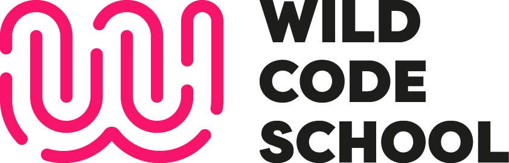

# Espace Partage projets

## Description

Dans cet espace, vous trouverez des projets réalisés par les étudiants de la Wild Code School REMOTE de la session de février 2024.

## Catégories

### [Projets 1](./projects/P1.md)

#### Technologies utilisées

### [Projets 2](./projects/P2.md)

#### Technologies utilisées

... A suivre

